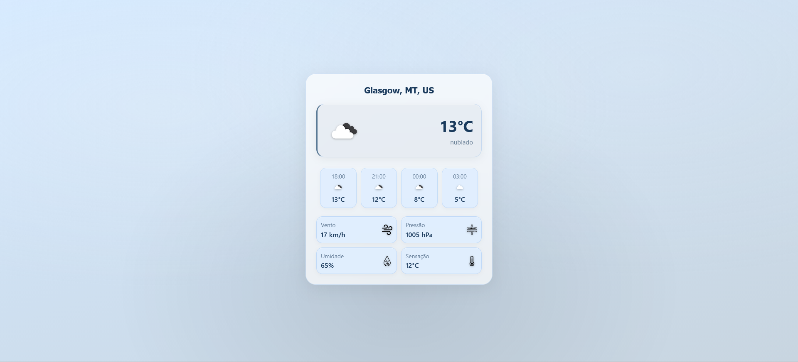

# 🌍 Weather App (Geolocation + API)

## 📌 Overview

A web application that uses geolocation and external APIs to display real-time weather information based on the user's location.

---

## 🚀 Features

* Get user location via browser
* Fetch weather data from API
* Display current weather information

---

## 📷 Preview

---

## 📄 Notes

This project was developed in the context of a study group.
